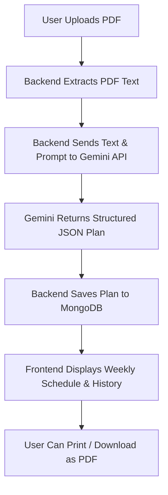

# AI Weekly Study Planner

An AI-powered application that extracts semester subjects and daily routines from an uploaded PDF, then generates an optimized weekly study schedule.

## Tech Stack

- **Frontend**: React, Vite, Tailwind CSS, Zustand (State Management), React Router
- **Backend**: Node.js, Express, MongoDB & Mongoose (Database), Multer & pdf-parse (PDF extraction)
- **AI Integration**: Google Gemini API (`gemini-2.5-flash-lite`)

## System Flow



1. **Upload & Parse**: The user uploads a routine/syllabus PDF in the React frontend. Express parses the PDF buffer using `pdf-parse`.
2. **AI Schedule Optimization**: The extracted text is sent to the Gemini API which parses priorities and routines, outputting a structured JSON schedule.
3. **Storage & UI**: The schedule is saved to MongoDB and instantly loaded in the React UI where it is organized day-by-day (Monday to Sunday) and color-coded by study priority.
4. **Export**: Users can browse history and print or download any planner.

## Setup Instructions

### Backend
1. Go to `backend` directory.
2. Install dependencies: `npm install`
3. Configure environment variables in `.env`:
   ```env
   PORT=5000
   MONGO_URI=your_mongodb_connection_string
   GEMINI_API_KEY=your_gemini_api_key
   ```
4. Start development server: `npm run dev`

### Frontend
1. Go to `frontend` directory.
2. Install dependencies: `npm install`
3. Configure environment variables in `.env`:
   ```env
   VITE_API_URL=http://localhost:5000
   ```
4. Start development server: `npm run dev`
